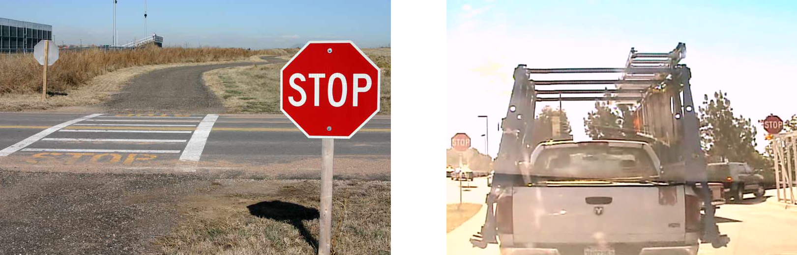
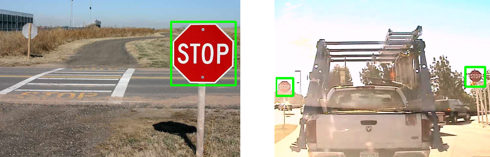
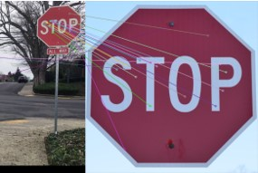
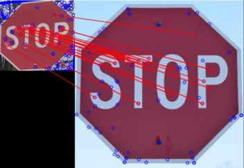
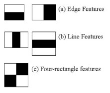
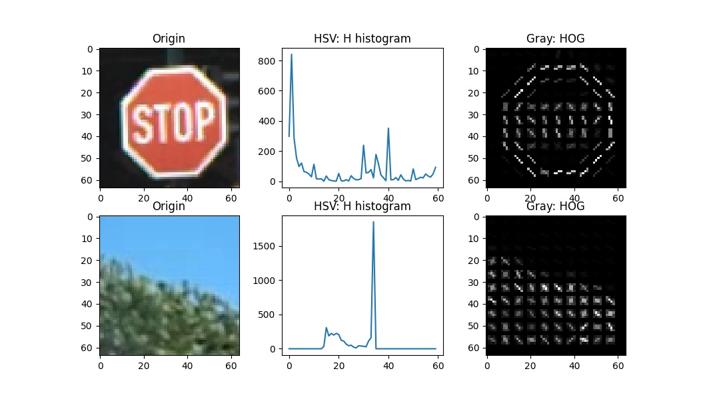

# Stop Sign Recognition

RBE 549 Computer Vision Final Project.

## Dataset

We are using a dataset collected by UCSD Self-driving cars team [LISA](http://cvrr-nas.ucsd.edu//LISA/lisa-traffic-sign-dataset.html) and stop sign images collected [from the internet](https://github.com/mbasilyan/Stop-Sign-Detection/tree/master/Stop%20Sign%20Dataset). We made some modifications for better testing our algorithms. Please refer to the README in dataset folder for more details.

A sample of the Online dataset and LISA dataset

## Run

To run the dataset test,

Method 1: Feature matching

`python3 feature_matching.py`

Method 2: Haar cascaded classifier

`python3 haar_cascade.py`

Method 3: HSV-SVM classifier

`python3 hsv_svm.py `

Recognition result

## Algorithms

##### Feature matching

Matching model and image

Matching model and ROI

##### Haar Cascade

Haar Feature

##### HSV-SVM 

HSV ROI Extraction

extraction results

  

SVM features

