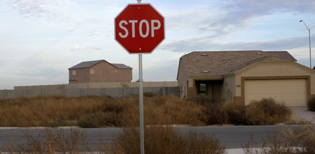
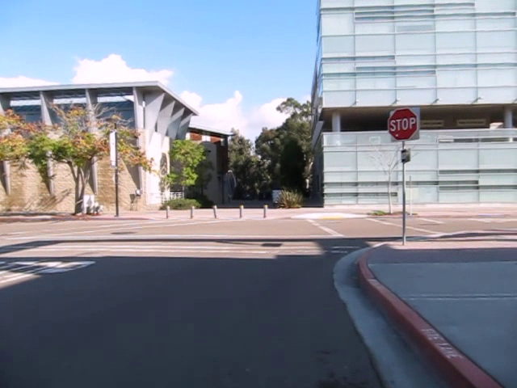

# Stop Sign Recognition

RBE 549 Computer Vision Final Project.

## Dataset

We are using a dataset collected by UCSD Self-driving cars team [LISA](http://cvrr-nas.ucsd.edu//LISA/lisa-traffic-sign-dataset.html) and stop sign images collected [from the internet](https://github.com/mbasilyan/Stop-Sign-Detection/tree/master/Stop%20Sign%20Dataset). We made some modifications for better testing our algorithms. Please refer to the README in dataset folder for more details.

A sample of online dataset

A sample of LISA dataset

## Run